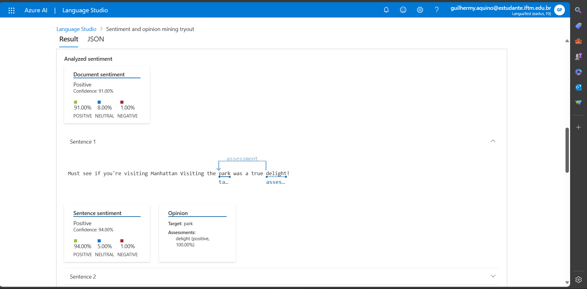
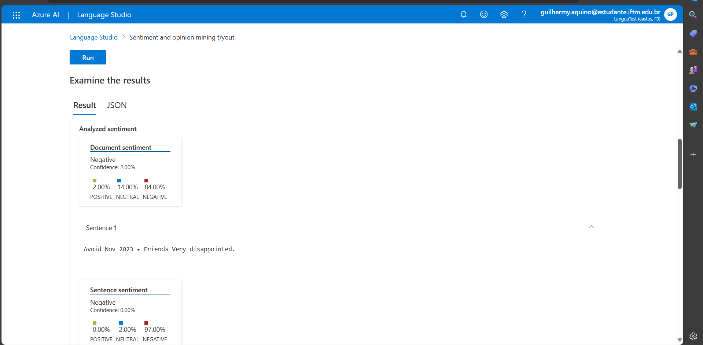
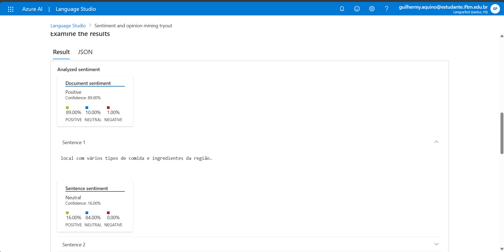
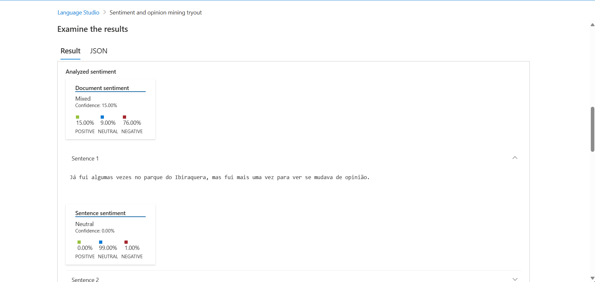

# RM GUILHERMY

## Quem sou eu?
Olá, meu nome é Guilhermy Pereira, sou um estudante de Engenharia de Computação, no Instituto Federal do Triângulo Mineiro (IFTM).

## Onde me encontrar?

# PROJETO LANGUAGE STUDIO

## Todas as fontes utilziadas para averiguação emocional foram retiradas de opiniões reais de pessoas no site TripAdvisor.

## A utilização do recurso de análise de emoção e sentimentos foi muito precisa.
## Este sistema implementado em grande escala para uma rede de empresas poderia facilitar em termos de melhorias, buscando maior satisfação para os clientes.

## Resultado Input 1

## Resultado Input 2

## Resultado Input 3

## Resultado Input 4

